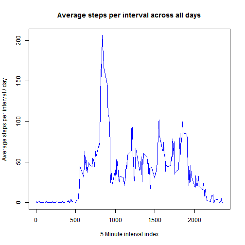
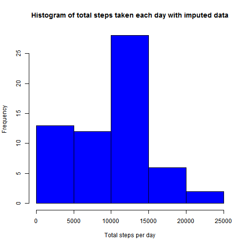
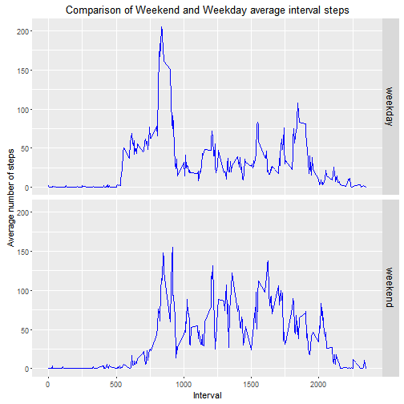

## Loading and preprocessing the data

```r
#A. Set working ddirectory
setwd("~/Data Scientist/Projects/RepRes")
#B. clear memory if required
#rm(list=ls())

#C. set url and file name
furl <- "https://d396qusza40orc.cloudfront.net/repdata%2Fdata%2Factivity.zip"
fname <- "repdata_data_activity.zip"
fpath <-  file.path("activity.csv")

#D. downlad the file
if (!file.exists(fname)) {
    download.file(furl, destfile = fname);
}

#E. unzip if not already unzipped
if (!file.exists(fpath))   unzip(fname,exdir='.')  else {message(paste(fpath, 'already exists'))}

#F.Store data into variable
alldata <- read.csv(fpath,stringsAsFactors = FALSE)

#G. convert date column into Date
alldata$date <- as.Date(alldata$date)
```


## What is mean total number of steps taken per day?

Generate the graphing data using dplyr library grouping on date

```r
#load library 
library(dplyr)


#generate graphing data
graphdata <- alldata %>% 
    group_by(date) %>% 
        summarize(total.steps.per.day=sum(steps,na.rm=TRUE))
```
Generate the histogram of the total steps per day and calculate mean and median

```r
#Histogram of the total steps
hist(graphdata$total.steps.per.day, col='blue',main='Histogram of total steps taken each day', xlab='Total steps per day', ylab='Frequency')
```


```r
#Find mean and medain
smean <- mean(graphdata$total.steps.per.day, na.rm=TRUE)
smedian <- median(graphdata$total.steps.per.day ,na.rm=TRUE)
smean <- format(round(smean,2), nsmall=2)
smedian <- format(round(smedian,2), nsmall=0)
```
The mean of total number of steps per day is 9354.23
The median of total number of steps per day is 10395

## What is the average daily activity pattern?
Generate the graphing data grouping over interval using dplyr

```r
#generate graphing data
graphdata <- alldata %>% 
    group_by(interval) %>% 
        summarize(avg.steps.per.interval=mean(steps,na.rm=TRUE))
```
Plot the line plot on the average steps per interval

```r
#Generate the line plot
with(graphdata, plot(x=interval, y=avg.steps.per.interval, type="l",col="blue", main="Average steps per interval across all days", xlab="5 Minute interval index", ylab="Average steps per interval / day "))
```



Find the interval with maximum average


```r
maxsteps <- max(graphdata$avg.steps.per.interval, na.rm=TRUE)
maxint <- graphdata[graphdata$avg.steps.per.interval==maxsteps,]$interval
```
The interval with the maximum average steps is 835

## Imputing missing values
Generate median values for each interval across all days

```r
graphdata <- alldata %>% 
    group_by(interval) %>% 
        summarize(medsteps=median(steps,na.rm=TRUE))
```

merge median value to all data per interval

```r
alldata <- merge(x=alldata, y=graphdata, by="interval")
```
Find the column with NA

```r
t <- as.data.frame(lapply(alldata, is.na))
sapply(t,sum)
```

```
## interval    steps     date medsteps 
##        0     2304        0        0
```

Impute na values in steps as it has NA's

```r
newdata <- mutate(alldata,steps=ifelse(is.na(steps),medsteps,steps))
```

Calculating histogram, mean and median of total steps each day

```r
#generate graphing data
graphdata <- newdata %>% 
    group_by(date) %>% 
        summarize(total.steps.per.day=sum(steps,na.rm=TRUE))

#Histogram of the total steps
hist(graphdata$total.steps.per.day, col='blue',main='Histogram of total steps taken each day with imputed data', xlab='Total steps per day', ylab='Frequency')
```



```r
#Find mean and medain
smean <- mean(graphdata$total.steps.per.day, na.rm=TRUE)
smedian <- median(graphdata$total.steps.per.day ,na.rm=TRUE)
smean <- format(round(smean,2), nsmall=2)
smedian <- format(round(smedian,2), nsmall=0)
```
The new mean of total number of steps per day is 9503.87 and has increased over the non imputed data.
The new median of total number of steps per day is 10395 and remains the same as the non imputed data primarily because the median was used to impute.


## Are there differences in activity patterns between weekdays and weekends?
Create vector with weekday or weekend

```r
wd <- ifelse(weekdays(newdata$date, abbreviate=TRUE) %in% c("Sat", "Sun"), "weekend", "weekday")
```

Convert to factor and add to the newdata

```r
wd <- factor(wd)
newdata <- cbind(newdata,wd)
```

Generate graph data

```r
graphdata <- newdata %>% group_by(wd,interval) %>% summarize(avgsteps=mean(steps))
```
Create plots in panels using ggplot2

```r
library(ggplot2)
g <- ggplot(graphdata, aes(interval, avgsteps)) +geom_line(color="blue")
g <- g + facet_grid(wd~.)
g <- g + labs(title="Comparison of Weekend and Weekday average interval steps", x="Interval", y="Average number of steps")
g <- g + theme(strip.text = element_text(size = 12, colour = "black", angle = 90))
g
```



Create the .md and .html file using knit2html

```r
#knit2html("PA1_template.Rmd", force_v1 = TRUE)
```

